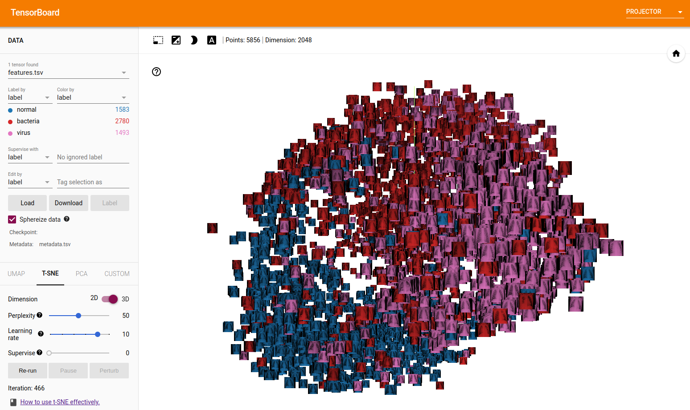

# Explainable-Neural-Networks


# Introduction

Following is the initial file structure. 
# Folders/File structure 
```bash
.
├── data
│   ├── test
│   │   ├── NORMAL
│   │   └── PNEUMONIA
│   ├── train
│   │   ├── NORMAL
│   │   └── PNEUMONIA
│   └── val
│       ├── NORMAL
│       └── PNEUMONIA
├── conda-env.yaml
├── src
├── LICENSE
├── notebooks
└── README.md
```

# Getting Started

1. Data

Curl down and unzip the data to the existing repositry using the command:
```bash
# download using
wget --load-cookies /tmp/cookies.txt "https://docs.google.com/uc?export=download&confirm=$(wget --quiet --save-cookies /tmp/cookies.txt --keep-session-cookies --no-check-certificate 'https://docs.google.com/uc?export=download&id=1BLViYnohD-S4u5p1DkXp1MOlCGe02w36' -O- | sed -rn 's/.*confirm=([0-9A-Za-z_]+).*/\1\n/p')&id=1BLViYnohD-S4u5p1DkXp1MOlCGe02w36" -O pneumonia.zip && rm -rf /tmp/cookies.txt
# Unzip using
unzip -q pneumonia.zip .
```
Alternatively download the dataset from [here](https://drive.google.com/file/d/1BLViYnohD-S4u5p1DkXp1MOlCGe02w36/view?usp=share_link).

2. Environment

Please ensure dependencies adhere to python 3.10
```bash
conda env create -f conda-env.yaml
conda activate xnn
```
1. Pre-commit hook

More information on precommit hook [here](https://pre-commit.com/).
```bash
pre-commit install
```


# FiftyOne

FiftyOne is a widely used solution to quickly view multiple images for computer vision tasks. Please run the following commands in docker to view the data, data has already been tagged with both "normal", "bacteria" and "virus" images for quick comparison. 

1. Build the service using the command:
```bash
docker build -f docker/fiftyone.Dockerfile \
    -t fiftyone:0.1.0 \
    --platform linux/amd64 .  
```
2. Run the service using the command:
```bash
docker run -p 5151:5151 \
    --name fiftyone \
    -v ~/Documents/coding/personal/Explainable-Neural-Networks/data:/data \
    fiftyone:0.1.0    
```
3. Access the fiftyone dashboard using the link [http://localhost:5151](http://localhost:5151) on your local computer

4. Stop the service using the command:
```bash
docker container stop fiftyone   

```
5. To remove the container use the command:
```bash
docker rm fiftyone   
```

# t-SNE

t-Distributed Stochastic Neighbor Embedding (t-SNE) is an unsupervised, non-linear technique primarily used for data exploration and visualizing high-dimensional data. In this project, a t-SNE vizualization has been created to better allow users to understand the images.

<p align="center">
  
  <p style="text-align: center;">(Above) Image sprite showing the images being classified using RESNET embeddings</p>
</p>
<p align="center">
  
  <p style="text-align: center;">(Above) Tensorboard showing t-SNE clustering according to the categories "normal", "bacteria" and "virus". </p>
</p>


# Contributing
- Outstanding features are listed in the project's kanban board [here](https://github.com/users/marmal88/projects/4/views/2)!
- Dont see an issue you want? raise an issue [here](https://github.com/marmal88/Explainable-Neural-Networks/issues)

## Commit msg
```
<type>: <short summary>
  │            │
  │            └─⫸ Summary in present tense. Not capitalized. No period at the end.
  │
  └─⫸ Commit Type: build|cicd|docs|feat|fix|node|refactor|test
```
